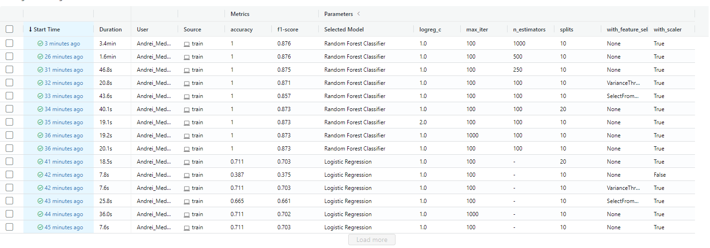
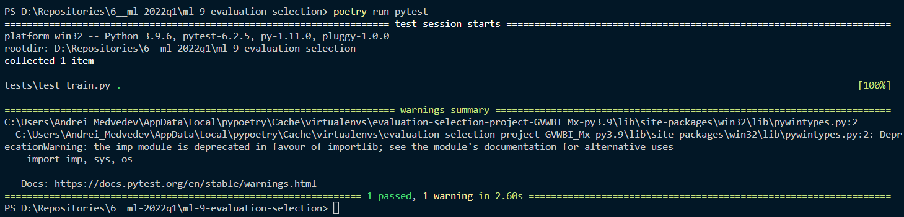

# 9 Evaluation Selection Project for RS School Machine Learning course.

I used [Forest Cover Type Prediction](https://www.kaggle.com/competitions/forest-cover-type-prediction/) dataset.

## Installation process:

This project allows you to train models for forest categories classification.

1. Clone this repository to your computer.

2. Download [Forest Cover Type Prediction](https://www.kaggle.com/competitions/forest-cover-type-prediction/) dataset, save csv locally (default path is *data/train.csv* in repository's root).

3. Make sure Python 3.9 and [Poetry](https://python-poetry.org/docs/) are installed on your machine.

4. Install the project dependencies (*run this and following commands in a terminal, from the root of a cloned repository*):
```sh
poetry install --no-dev
```
5. To generate dataset profiling report (EDA), use the following command:
```sh
poetry run profiling -d <path to csv with data>
```
or if you just want to visualize dataset:
```sh
poetry run dataset_gui -d <path to csv with data>
```

## Training process:

6. Run training process with the following commands:

- Logistic Regression:
```sh
poetry run train --model-selector 1 --max-iter 100 --logreg-c 10 --with-feature-selection 0
```
You can use different parameters.

- Random Forest Classifier:
```sh
poetry run train --model-selector 2 --n-estimators 100 --with-feature-selection 0
```

You can configure additional options (such as hyperparameters) in the CLI. To get a full list of them, use help:
```sh
poetry run train --help
```

7. I tried to make --with-grid method to find best hyperparameters. But unfortunately it fails ((.
You can check possible methods in remarks.

## Making reports:

8. Run MLflow UI to see the information about experiments you conducted:
```sh
poetry run mlflow ui
```

Here is the results for experiments for Logistic Regression and Random Forest Classifier:


## Development

The code in this repository is tested, formatted with black, and pass mypy typechecking before being commited to the repository.

Install all requirements (including dev requirements) to poetry environment:
```sh
poetry install
```
Now you can use developer instruments, e.g. pytest:
```sh
poetry run pytest
```


Check your code annotation with mypy by using poetry:
```sh
poetry run mypy .
```

## Homework statement

1. Use the [Forest train dataset](https://www.kaggle.com/competitions/forest-cover-type-prediction). You will solve the task of forest cover type prediction and compete with other participants. **(necessary condition, 0 points for the whole homework if not done)**
--- done

2. Format your homework as a Python package. Use an [src layout](https://blog.ionelmc.ro/2014/05/25/python-packaging/#the-structure) or choose some other layout that seems reasonable to you, explain your choice in the README file. Don't use Jupyter Notebooks for this homework. Instead, write your code in .py files. **(necessary condition, 0 points for the whole homework if not done)**
--- done

3. Publish your code to Github. **(necessary condition, 0 points for the whole homework if not done)**
    1. Commits should be small and pushed while you're working on a project (not at the last moment, since storing unpublished code locally for a long time is not reliable: imagine something bad happens to your PC and you lost all your code). Your repository should have at least 30 commits if you do all non-optional parts of this homework. **(12 points)**
--- done - 12 points

4. Use [Poetry](https://python-poetry.org/) to manage your package and dependencies. **(6 points)**
--- done - 6 points

5. Create a data folder and place the dataset there. **(necessary condition, 0 points for the whole homework if not done. *Note for reviewers: data folder won't be seen on GitHub if added to gitignore, it's OK, check gitignore*)**
    1. Don't forget to add your data to gitignore. **(5 points)**
    2. (optional) Write a script that will generate you an EDA report, e.g. with [pandas profiling](https://pandas-profiling.github.io/pandas-profiling/docs/master/rtd/)
--- done - 5 points

6. Write a script that trains a model and saves it to a file. Your script should be runnable from the terminal, receive some arguments such as the path to data, model configurations, etc. To create CLI, you can use argparse, click (as in the demo), hydra, or some other alternatives. **(10 points)**
--- done - 10 points

    1. (optional) Register your script in pyproject.toml. This way you can run it without specifying a full path to a script file. **(2 points)**
	 --- done - 2 points

7. Choose some metrics to validate your model (at least 3) and calculate them after training. Use K-fold cross-validation. **(10 points maximum: 2 per metric + 4 for K-fold. *Note for reviewers: K-fold CV may be overwritten by nested CV if the 9th task is implemented, check the history of commits in this case. If more than 3 metrics were chosen, only 3 are graded*)**
--- done - 10 points

8. Conduct experiments with your model. Track each experiment into MLFlow. Make a screenshot of the results in the MLFlow UI and include it in README. You can see the screenshot example below, but in your case, it may be more complex than that. Choose the best configuration with respect to a single metric (most important of all metrics you calculate, according to your opinion). 
    1. Try at least three different sets of hyperparameters for each model. **(3 points)**
    2. Try at least two different feature engineering techniques for each model. **(4 points)**
    3. Try at least two different ML models. **(4 points)**
--- done - 11 points	

9. Instead of tuning hyperparameters manually, use automatic hyperparameter search for each model (choose a single metric again). Estimate quality with nested cross-validation, e.g. as described [here](https://machinelearningmastery.com/nested-cross-validation-for-machine-learning-with-python/). Although you used a single metric for model selection, the quality should be measured with all the metrics you chose in task 7. **(10 points)**
--- unfortunately it "ne vzletelo" )) - 0 points

10. In your README, write instructions on how to run your code (training script and optionally other scripts you created, such as EDA). If someone who cloned your repository correctly follows the steps you describe, the script should work for them and produce the same results as it produced on your PC (so don't forget about specifying random seeds). The instructions should be as unambiguous and easy to follow as possible. **(10 points)**
--- done - 10 points

    1. (optional) If you do the optional tasks below, add a development guide to README. You should specify what other developers should do to continue working on your code: what dependencies they should install, how they should run tests, formatting, etc. **(2 points)**
	 --- done - 2 points

11. (optional) Test your code. 
    1. (optional) Single or more tests for error cases without using fake/sample data and filesystem isolation, as in the demo. **(3 points)**
    2. (optional) Test for a valid input case with test data, filesystem isolation, and checking saved model for correctness. **(5 points)**
	 --- done 3 points

# Total - 71 points

I need 2 more commits )) so I write and delete this line ))) Good luck everybody!